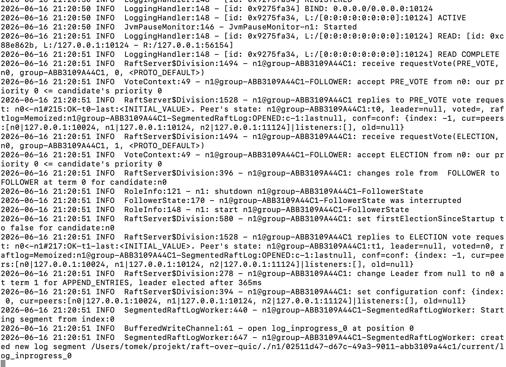

# Implementacja QUIC w Apache Ratis — szczegółowy opis architektury

## Spis treści

1. [Kontekst — dlaczego QUIC?](#1-kontekst--dlaczego-quic)
2. [Struktura modułu ratis-quic](#2-struktura-modułu-ratis-quic)
3. [Warstwa transportu — jak działa QUIC pod spodem](#3-warstwa-transportu--jak-działa-quic-pod-spodem)
4. [QuicRpcService — serwer](#4-quicrpcservice--serwer)
5. [QuicRpcProxy — klient peer-to-peer](#5-quicrpcproxy--klient-peer-to-peer)
6. [QuicClientRpc — klient aplikacyjny](#6-quicclientrpc--klient-aplikacyjny)
7. [Protokół tagów strumieniowych](#7-protokół-tagów-strumieniowych)
8. [Pipeline Netty dla każdego strumienia](#8-pipeline-netty-dla-każdego-strumienia)
9. [Mechanizm reconnect](#9-mechanizm-reconnect)
10. [TLS i konfiguracja](#10-tls-i-konfiguracja)
11. [Porównanie z implementacją Netty/TCP](#11-porównanie-z-implementacją-nettytcp)
12. [Diagram przepływu wiadomości](#12-diagram-przepływu-wiadomości)
13. [Znane ograniczenia i potencjalne usprawnienia](#13-znane-ograniczenia-i-potencjalne-usprawnienia)

---

## 1. Kontekst — dlaczego QUIC?

Apache Ratis implementuje algorytm konsensusu Raft. Węzły klastra wymieniają między sobą cztery typy wiadomości:

| Typ wiadomości        | Częstotliwość        | Rozmiar              |
|-----------------------|----------------------|----------------------|
| AppendEntries (logi)  | wysoka               | zmienny, może być MB |
| Heartbeat             | bardzo wysoka (~10/s)| mały, kilkadziesiąt B|
| RequestVote           | niska (tylko elekcja)| mały                 |
| InstallSnapshot       | sporadyczna          | bardzo duży (GB)     |

**Problem z TCP (Netty/TCP):** TCP to jeden strumień bajtów na połączenie. Wszystkie cztery typy wiadomości lecą jednym gniazdem. Jeśli `AppendEntries` z dużą porcją logów jest w trakcie wysyłania, `Heartbeat` czeka w kolejce — to tzw. **head-of-line blocking (HOL)**. Gdy heartbeat spóźni się wystarczająco, follower uzna lidera za martwego i zainicjuje niepotrzebną elekcję.

**Rozwiązanie QUIC:** QUIC (RFC 9000) działa nad UDP i daje **niezależne strumienie wewnątrz jednego połączenia UDP**. Opóźnienie jednego strumienia nie blokuje innych. Każdy typ wiadomości Raft dostaje własny strumień, więc heartbeaty nigdy nie stoją za logami.

Dodatkowe cechy QUIC istotne dla Ratis:
- **TLS 1.3 jest obowiązkowy** — wbudowany w uścisk dłoni QUIC (0-RTT lub 1-RTT)
- **Multiplexing** bez HOL na poziomie protokołu, nie aplikacji
- **Szybsze odtwarzanie połączenia** po utracie pakietu — QUIC retransmituje tylko utracony strumień, nie resetuje całego połączenia
- **Connection migration** — połączenie przeżywa zmianę IP klienta (przydatne przy failover)

---

## 2. Struktura modułu ratis-quic

```
ratis-quic/src/main/java/org/apache/ratis/quic/
├── QuicFactory.java          ← punkt wejścia; tworzy serwer i klienta
├── QuicConfigKeys.java       ← klucze konfiguracyjne (host, port, TLS)
├── QuicRpcService.java       ← SERWER: binduje UDP, odbiera połączenia QUIC
├── QuicRpcProxy.java         ← KLIENT P2P: proxy do jednego peer serwera
├── client/
│   └── QuicClientRpc.java    ← KLIENT APLIKACYJNY: używany przez CounterClient itp.
└── codec/
    ├── ShadedProtobufDecoder.java  ← dekoder protobuf (shaded Netty)
    └── ShadedProtobufEncoder.java  ← enkoder protobuf (shaded Netty)
```

Zależność od zewnętrznej biblioteki: **`netty-incubator-codec-quic`** — implementacja QUIC na bazie BoringSSL (Google) przez JNI, wbudowana w Netty jako moduł inkubacyjny. Dostarcza klasy `QuicChannel`, `QuicStreamChannel`, `QuicClientCodecBuilder`, `QuicServerCodecBuilder`.

---

## 3. Warstwa transportu — jak działa QUIC pod spodem

### TCP vs QUIC — model połączenia

```
TCP (Netty):
  Klient ──────── TCP socket ──────── Serwer
                 (1 strumień)

QUIC:
  Klient ──────── UDP socket ──────── Serwer
                 QuicChannel
                 /    |    \    \
           stream0 stream1 stream2 stream3
           (AE)   (HB)    (IS)    (RV)
```

### Jak QUIC identyfikuje połączenia

Tradycyjny TCP identyfikuje połączenie przez czwórkę: `(src_ip, src_port, dst_ip, dst_port)`. QUIC używa **Connection ID** — losowego identyfikatora negocjowanego podczas handshake. Oznacza to, że połączenie przeżywa zmianę adresu IP (np. failover, NAT rebinding).

### Strumienie QUIC

Każde połączenie (`QuicChannel`) może mieć wiele strumieni (`QuicStreamChannel`). Strumień to:
- niezależna, zamawiana sekwencja bajtów
- może być jednokierunkowy (UNIDIRECTIONAL) lub dwukierunkowy (BIDIRECTIONAL)
- ma własne sterowanie przepływem (flow control)
- utrata pakietu na jednym strumieniu **nie blokuje** innych strumieni

W tej implementacji używane są wyłącznie strumienie **BIDIRECTIONAL** — request idzie w jednym kierunku, response wraca tym samym strumieniem.

---

## 4. QuicRpcService — serwer

**Plik:** `ratis-quic/src/main/java/org/apache/ratis/quic/QuicRpcService.java`

### Startup — jak serwer się uruchamia

```java
// 1. Budowanie kontekstu TLS (TLS 1.3 obowiązkowe w QUIC)
QuicSslContext sslCtx = buildServerSslContext(server);
//    → jeśli cert/key skonfigurowane: wczytuje z pliku PEM
//    → jeśli nie: generuje SelfSignedCertificate (tylko dev/test)

// 2. Inicjalizator strumieni — każdy nowy strumień dostaje StreamTypeDecoder
ChannelInitializer<QuicStreamChannel> streamInit = ch -> {
    ch.pipeline().addLast(new StreamTypeDecoder());
};

// 3. Konfiguracja serwera QUIC
ChannelHandler quicCodec = new QuicServerCodecBuilder()
    .sslContext(sslCtx)
    .maxIdleTimeout(30_000, MILLISECONDS)
    .initialMaxData(10_000_000)                        // flow control całego połączenia
    .initialMaxStreamDataBidirectionalLocal(1_000_000)
    .initialMaxStreamDataBidirectionalRemote(1_000_000)
    .initialMaxStreamsBidirectional(100)               // max 100 otwartych strumieni
    .tokenHandler(InsecureQuicTokenHandler.INSTANCE)
    .streamHandler(streamInit)
    .build();

// 4. Bind na UDP (nie TCP!)
new Bootstrap()
    .group(group)
    .channel(NioDatagramChannel.class)  // ← UDP, nie TCP
    .handler(quicCodec)
    .bind(socketAddress);
```

### StreamTypeDecoder — kluczowy element protokołu

Każdy nowy przychodzący strumień przechodzi przez `StreamTypeDecoder`. Jego zadanie: **przeczytać pierwszy bajt (tag) i skonfigurować resztę pipeline'u**.

```java
class StreamTypeDecoder extends ByteToMessageDecoder {
    @Override
    protected void decode(ChannelHandlerContext ctx, ByteBuf in, List<Object> out) {
        if (!in.isReadable()) return;

        byte tag = in.readByte();  // JEDEN bajt — identyfikator typu
        ChannelPipeline p = ctx.pipeline();

        // Dodaj wspólne handlery framing + codec
        p.addLast(new ProtobufVarint32FrameDecoder());
        p.addLast(new ProtobufVarint32LengthFieldPrepender());
        p.addLast(ShadedProtobufEncoder.INSTANCE);

        if (tag == TAG_READ_INDEX) {
            p.addLast(new ShadedProtobufDecoder<>(ReadIndexRequestProto.getDefaultInstance()));
            p.addLast(readIndexInboundHandler);
        } else {
            p.addLast(new ShadedProtobufDecoder<>(RaftNettyServerRequestProto.getDefaultInstance()));
            p.addLast(inboundHandler);
        }

        p.remove(this);  // ← usuwa siebie; Netty automatycznie przepuszcza
                         //   buforowane bajty do następnego handlera
    }
}
```

Usunięcie `ByteToMessageDecoder` z pipeline po przeczytaniu tagu jest kluczowe — Netty przeleje pozostałe bajty z bufora kumulacyjnego do nowego handlera bez utraty danych.

### InboundHandler — dispatcher żądań

```java
@ChannelHandler.Sharable  // jeden obiekt dzielony przez wszystkie strumienie
class InboundHandler extends SimpleChannelInboundHandler<RaftNettyServerRequestProto> {
    @Override
    protected void channelRead0(ChannelHandlerContext ctx, RaftNettyServerRequestProto proto) {
        ctx.writeAndFlush(handle(proto));  // synchronicznie obsługuje i odsyła odpowiedź
    }
}
```

Metoda `handle()` to wielki `switch` po typie żądania — deleguje do odpowiedniej metody `server.*`
(np. `server.appendEntries()`, `server.requestVote()` itd.) i pakuje wynik w `RaftNettyServerReplyProto`.

---

## 5. QuicRpcProxy — klient peer-to-peer

**Plik:** `ratis-quic/src/main/java/org/apache/ratis/quic/QuicRpcProxy.java`

To jest serce implementacji — zarządza połączeniem do **jednego konkretnego peer serwera**.

### Klasa Connection — 4 trwałe strumienie

```
QuicChannel (jedno połączenie UDP)
├── appendEntriesStream   (TAG 0x00) — replikacja logów
├── heartbeatStream       (TAG 0x01) — keep-alive lidera
├── installSnapshotStream (TAG 0x02) — transfer snapshotów
└── requestVoteStream     (TAG 0x03) — głosowanie w elekcji
```

Każdy strumień ma przypisany `StreamHandler` — obiekt trzymający mapę oczekujących żądań
(`pending: Map<callId, CompletableFuture>`).

### Jak wysyłane jest żądanie

```java
public CompletableFuture<RaftNettyServerReplyProto> sendAsync(RaftNettyServerRequestProto proto) {
    Connection conn = connectionRef.get();
    switch (proto.getRaftNettyServerRequestCase()) {
        case APPENDENTRIESREQUEST:
            if (proto.getAppendEntriesRequest().getEntriesCount() == 0) {
                stream  = conn.heartbeatStream;     // ← brak wpisów = heartbeat
                handler = conn.heartbeatHandler;
            } else {
                stream  = conn.appendEntriesStream; // ← są wpisy = replikacja
                handler = conn.appendEntriesHandler;
            }
            break;
        case INSTALLSNAPSHOTREQUEST:
            stream = conn.installSnapshotStream;
            // ...
        case REQUESTVOTEREQUEST:
        case STARTLEADERELECTIONREQUEST:
            stream = conn.requestVoteStream;
            // ...
        default:
            return sendOnNewStream(proto); // ← żądania klienta = nowy efemeryczny strumień
    }
    return handler.send(stream, proto);
}
```

**Kluczowy trick:** Heartbeat i AppendEntries to ten sam typ protobuf (`AppendEntriesRequest`),
ale rozróżniane po liczbie wpisów. Heartbeat idzie osobnym strumieniem, żeby nigdy nie czekał
za dużą porcją logów.

### StreamHandler — zarządzanie żądaniami w locie

```java
class StreamHandler extends SimpleChannelInboundHandler<RaftNettyServerReplyProto> {

    // mapa: callId → CompletableFuture czekający na odpowiedź
    private final Map<Long, CompletableFuture<RaftNettyServerReplyProto>> pending =
        new ConcurrentHashMap<>();

    CompletableFuture<RaftNettyServerReplyProto> send(
            QuicStreamChannel streamChannel, RaftNettyServerRequestProto request) {

        CompletableFuture<RaftNettyServerReplyProto> future = new CompletableFuture<>();
        long callId = getCallIdFromRequest(request);
        pending.put(callId, future);  // zarejestruj zanim wyślesz

        streamChannel.writeAndFlush(request).addListener(cf -> {
            if (!cf.isSuccess()) {
                if (pending.remove(callId, future)) {
                    future.completeExceptionally(cf.cause());
                }
            }
        });
        return future;
    }

    @Override
    protected void channelRead0(ChannelHandlerContext ctx, RaftNettyServerReplyProto proto) {
        long callId = getCallId(proto);
        CompletableFuture<RaftNettyServerReplyProto> future = pending.remove(callId);
        // dopasowanie odpowiedzi do oczekującego żądania po callId
        if (proto.getRaftNettyServerReplyCase() == EXCEPTIONREPLY) {
            future.completeExceptionally(...);
        } else {
            future.complete(proto);
        }
    }
}
```

Dzięki temu na jednym strumieniu może być **wiele żądań w locie jednocześnie** (request pipelining)
— odpowiedzi są dopasowywane po `callId`, nie po kolejności.

### Jak otwierany jest nowy strumień

```java
private QuicStreamChannel openStream(QuicChannel qc, byte tag, StreamHandler handler)
        throws InterruptedException {

    // Handler który przy aktywacji strumienia wyśle tag i usunie siebie
    ChannelInboundHandlerAdapter tagWriter = new ChannelInboundHandlerAdapter() {
        @Override
        public void channelActive(ChannelHandlerContext ctx) {
            ByteBuf buf = ctx.alloc().buffer(1).writeByte(tag);
            ctx.writeAndFlush(buf);       // ← pierwszy bajt to tag typu
            ctx.pipeline().remove(this);
            ctx.fireChannelActive();
        }
    };

    return qc.createStream(QuicStreamType.BIDIRECTIONAL,
        new ChannelInitializer<QuicStreamChannel>() {
            @Override
            protected void initChannel(QuicStreamChannel ch) {
                ChannelPipeline p = ch.pipeline();
                p.addLast(tagWriter);                           // 1. wyślij tag
                p.addLast(new ProtobufVarint32FrameDecoder());  // 2. framing
                p.addLast(new ShadedProtobufDecoder<>(...));    // 3. decode proto
                p.addLast(new ProtobufVarint32LengthFieldPrepender()); // 4. length prefix
                p.addLast(ShadedProtobufEncoder.INSTANCE);     // 5. encode proto
                p.addLast(handler);                             // 6. logika biznesowa
            }
        }).sync().getNow();
}
```

---

## 6. QuicClientRpc — klient aplikacyjny

**Plik:** `ratis-quic/src/main/java/org/apache/ratis/quic/client/QuicClientRpc.java`

Używany przez aplikacje zewnętrzne (np. `CounterClient`). Każde żądanie aplikacji trafia
przez `QuicRpcProxy.sendOnNewStream()` — **otwierany jest nowy, efemeryczny strumień QUIC**
z tagiem `TAG_CLIENT_REQUEST (0x04)`, który jest zamykany po otrzymaniu odpowiedzi.

```
CounterClient.increment()
    → QuicClientRpc.sendRequestAsync()
        → QuicRpcProxy.sendAsync()
            → sendOnNewStream()           ← nowy strumień per żądanie
                → otwarcie QuicStreamChannel z TAG 0x04
                → wysłanie RaftClientRequestProto
                → odebranie RaftClientReplyProto
                → zamknięcie strumienia
```

Klient ma timeout zaimplementowany przez `TimeoutExecutor` — jeśli odpowiedź nie przyjdzie
w czasie `raft.client.rpc.request.timeout`, `CompletableFuture` jest kończony wyjątkiem
`TimeoutIOException`.

---

## 7. Protokół tagów strumieniowych

To jedyne miejsce gdzie implementacja dodaje własny protokół ponad QUIC.
Pierwszy bajt każdego nowego strumienia identyfikuje jego rolę:

```
Bajt 0: [TAG]
Bajty 1+: Protobuf varint32-framed messages
```

| Stała                  | Wartość | Kierunek      | Typ żądania                       | Model strumienia |
|------------------------|---------|---------------|-----------------------------------|------------------|
| `TAG_APPEND_ENTRIES`   | `0x00`  | peer → peer   | `AppendEntriesRequest` (z logami) | trwały           |
| `TAG_HEARTBEAT`        | `0x01`  | peer → peer   | `AppendEntriesRequest` (pusty)    | trwały           |
| `TAG_INSTALL_SNAPSHOT` | `0x02`  | peer → peer   | `InstallSnapshotRequest`          | trwały           |
| `TAG_REQUEST_VOTE`     | `0x03`  | peer → peer   | `RequestVoteRequest`              | trwały           |
| `TAG_CLIENT_REQUEST`   | `0x04`  | klient → peer | dowolny `RaftNettyServerRequest`  | efemeryczny      |
| `TAG_READ_INDEX`       | `0x05`  | peer → peer   | `ReadIndexRequest`                | efemeryczny      |

**Strumień trwały** — żyje przez cały czas życia połączenia, wiele żądań po nim.
**Strumień efemeryczny** — otwierany per-żądanie, zamykany po odebraniu odpowiedzi.

---

## 8. Pipeline Netty dla każdego strumienia

Każdy strumień QUIC ma własny **Netty ChannelPipeline** — łańcuch handlerów przetwarzających
bajty przychodzące i wychodzące.

### Po stronie klienta (QuicRpcProxy):

```
Bajty UDP (przychodzące)
    ↓
ProtobufVarint32FrameDecoder       ← składa pełne ramki (czyta prefiks długości)
    ↓
ShadedProtobufDecoder              ← deserializuje bajty → RaftNettyServerReplyProto
    ↓
StreamHandler.channelRead0()       ← dopasowuje do pending[callId], kończy Future

Bajty UDP (wychodzące)
    ↑
ProtobufVarint32LengthFieldPrepender  ← dodaje prefiks długości (varint32)
    ↑
ShadedProtobufEncoder                  ← serializuje RaftNettyServerRequestProto → bajty
    ↑
StreamHandler.send()                   ← writeAndFlush(proto)
```

### Po stronie serwera (QuicRpcService):

```
Bajty UDP (przychodzące, nowy strumień)
    ↓
StreamTypeDecoder               ← czyta 1 bajt tagu, konfiguruje resztę, usuwa siebie
    ↓
ProtobufVarint32FrameDecoder
    ↓
ShadedProtobufDecoder           ← → RaftNettyServerRequestProto lub ReadIndexRequestProto
    ↓
InboundHandler.channelRead0()   ← wywołuje handle(proto), pisze odpowiedź

Bajty UDP (wychodzące)
    ↑
ProtobufVarint32LengthFieldPrepender
    ↑
ShadedProtobufEncoder
    ↑
ctx.writeAndFlush(replyProto)
```

### Dlaczego ShadedProtobufDecoder, nie standardowy ProtobufDecoder?

Ratis używa **shadowanego Netty** (`ratis-thirdparty`) — przebudowanego Netty ze zmienionym
package prefix, żeby uniknąć konfliktów z Netty używanym przez inne biblioteki (np. Hadoop).
Moduł `ratis-quic` używa **nieshadowanego** Netty incubator QUIC, bo `netty-incubator-codec-quic`
nie istnieje w wersji shadowanej. Dlatego zamiast standardowego `ProtobufDecoder` (który odwołuje
się do `org.apache.ratis.thirdparty.io.netty`) napisano `ShadedProtobufDecoder` — wrapper który
"tłumaczy" między dwoma wersjami Netty.

---

## 9. Mechanizm reconnect

Netty/TCP ma wbudowany reconnect przez `PeerProxyMap` — przy utracie TCP połączenia tworzony
jest nowy `NettyRpcProxy`. QUIC musi to obsłużyć inaczej, bo strumienie i połączenia QUIC
mają własny cykl życia.

### Kiedy reconnect jest wyzwalany

`StreamHandler.channelInactive()` wywoływane jest gdy jeden ze strumieni QUIC staje się
nieaktywny (np. serwer zamknął połączenie, timeout, utrata pakietów). To wyzwala `scheduleReconnect()`.

### Ochrona przed wielokrotnymi reconnectami

Cztery strumienie mogą stać się nieaktywne prawie jednocześnie. Flaga atomowa
`AtomicBoolean reconnecting` gwarantuje, że tylko jeden wywołuje faktyczny reconnect:

```java
private void scheduleReconnect() {
    if (closed) return;
    if (!reconnecting.compareAndSet(false, true)) return;  // już ktoś reconnectuje

    Connection old = connectionRef.getAndSet(null);  // atomowo usuń stare połączenie
    if (old != null) {
        old.failAll(new AlreadyClosedException("Reconnecting to " + peer));
        old.quicChannel.close();
    }
    group.schedule(this::doReconnect, 200, MILLISECONDS);  // czekaj 200ms
}

private void doReconnect() {
    if (closed) { reconnecting.set(false); return; }
    try {
        Connection conn = connect();  // nowe QuicChannel + 4 nowe strumienie
        connectionRef.set(conn);
        reconnecting.set(false);
    } catch (Exception e) {
        group.schedule(this::doReconnect, 1_000, MILLISECONDS);  // retry co 1s
    }
}
```

### UDP socket jest reużywany

`udpChannel` (gniazdo UDP) jest tworzony raz w konstruktorze i **nie jest zamykany podczas
reconnectu** — tylko `QuicChannel` (logiczne połączenie QUIC) jest zastępowane. To eliminuje
kosztowne `bind()` przy każdym reconneccie.

---

## 10. TLS i konfiguracja

QUIC mandatowo wymaga TLS 1.3. Implementacja obsługuje trzy tryby:

### Tryb 1: Certyfikaty z pliku (produkcja)
```properties
raft.quic.server.tls.cert=/etc/ratis/server.crt
raft.quic.server.tls.key=/etc/ratis/server.key
raft.quic.client.tls.ca-cert=/etc/ratis/ca.crt
```

### Tryb 2: Self-signed (dev/test)
Gdy cert/key nie są skonfigurowane, `SelfSignedCertificate` z Netty generuje tymczasowy
certyfikat przy każdym starcie. Klienci muszą mieć `raft.quic.client.tls.insecure=true`.

### Tryb 3: Mutual TLS (mTLS)
```properties
raft.quic.client.tls.cert=/etc/ratis/client.crt
raft.quic.client.tls.key=/etc/ratis/client.key
```
Klient prezentuje własny certyfikat — serwer go weryfikuje.

### ALPN
Negocjacja protokołu aplikacji: `"ratis-quic"` (stała `QuicConfigKeys.ALPN`).
To pozwala serwerowi odrzucić przypadkowych klientów.

---

## 11. Porównanie z implementacją Netty/TCP

### Model połączenia

| Aspekt                    | Netty/TCP (`NettyRpcProxy`)                  | QUIC (`QuicRpcProxy`)                             |
|---------------------------|----------------------------------------------|---------------------------------------------------|
| Protokół transportu       | TCP (stream)                                 | QUIC nad UDP                                      |
| Połączenie per peer        | 1 TCP socket                                 | 1 UDP socket → 1 QuicChannel                      |
| Strumienie per połączenie  | 1 (wszystko razem)                           | 4 trwałe + efemeryczne per żądanie                |
| Head-of-line blocking      | TAK — duże AE blokuje HB                    | NIE — każdy typ na osobnym strumieniu             |
| TLS                        | opcjonalne (SslContext dodawany do pipeline) | obowiązkowe (wbudowane w QUIC handshake)          |
| Handshake RTT              | TCP 3-way + TLS 1.3 = 2 RTT minimum         | QUIC: 1 RTT (lub 0-RTT przy reconnect)           |
| Reconnect                  | PeerProxyMap tworzy nowy NettyRpcProxy       | scheduleReconnect() po 200ms, reużywa UDP socket  |
| Identyfikacja połączenia   | (src_ip, src_port, dst_ip, dst_port)         | Connection ID — przeżywa zmianę IP               |

### Struktura klas

| Rola                    | Netty/TCP                             | QUIC                                      |
|-------------------------|---------------------------------------|-------------------------------------------|
| Fabryka                 | `NettyFactory`                        | `QuicFactory`                             |
| Serwer                  | `NettyRpcService`                     | `QuicRpcService`                          |
| Proxy (outgoing P2P)    | `NettyRpcProxy`                       | `QuicRpcProxy`                            |
| Klient aplikacyjny      | `NettyClientRpc`                      | `QuicClientRpc`                           |
| Konfiguracja            | `NettyConfigKeys`                     | `QuicConfigKeys`                          |
| Enkoder/dekoder         | `ProtobufEncoder/Decoder` (shaded)    | `ShadedProtobufEncoder/Decoder` (wrapper) |

### Mapowanie kodu — NettyRpcProxy vs QuicRpcProxy

**NettyRpcProxy.Connection (TCP):**
```java
// 1 połączenie, 1 mapa pending na wszystkie typy żądań
private final Map<Long, CompletableFuture<...>> replies = new ConcurrentHashMap<>();

// Wszystkie żądania — jedna kolejka, jeden kanał
synchronized CompletableFuture<...> offer(RaftNettyServerRequestProto request) {
    replies.put(callId, reply);
    client.writeAndFlush(request);  // jeden TCP stream
    return reply;
}
```

**QuicRpcProxy.Connection (QUIC):**
```java
// 4 oddzielne strumienie, 4 oddzielne mapy pending
final StreamHandler appendEntriesHandler;   // własna mapa pending
final StreamHandler heartbeatHandler;       // własna mapa pending
final StreamHandler installSnapshotHandler;
final StreamHandler requestVoteHandler;

// Żądanie trafia do odpowiedniego handlera/strumienia
handler.send(stream, request);
```

### Dispatcher po stronie serwera

Netty/TCP i QUIC używają **identycznej logiki** `handle()` — ten sam `switch` po
`getRaftNettyServerRequestCase()`. To celowy design: serwer QUIC (`QuicRpcService`)
skopiował `handle()` z `NettyRpcService`. Różnica jest tylko w warstwie transportu.

### HOL blocking — konkretny przykład

```
Scenariusz: Lider wysyła batch 10MB logów do followera (AE),
            jednocześnie musi wysłać heartbeat (HB).

Netty/TCP:
  ──────────────────────────────────────────────────────────────►
  [AE 10MB ....................................................][HB]
  ^-- HB czeka ~100ms za dużym AE
  ^-- follower może ogłosić timeout i zainicjować elekcję!

QUIC:
  Stream 0 (AE): [AE 10MB ..............................................]
  Stream 1 (HB): [HB][HB][HB]  ← natychmiastowe, niezależne
  ^-- follower zawsze dostaje HB na czas
```

---

## 12. Diagram przepływu wiadomości

### AppendEntries (lider → follower)

```
Lider (QuicRpcProxy)                   Sieć QUIC          Follower (QuicRpcService)
        │                                                           │
        │  server.appendEntries(req)                               │
        ↓                                                           │
  sendAsync(AE)                                                     │
  → conn.appendEntriesHandler.send(                                │
        conn.appendEntriesStream, proto)                           │
        │                                                           │
        │──── [TAG:0x00][varint32-len][protobuf bytes] ───────────►│
        │                                                           │
        │                                     StreamTypeDecoder czyta 0x00
        │                                     → konfiguruje pipeline AE
        │                                     InboundHandler.channelRead0()
        │                                     → server.appendEntries()
        │                                     → ctx.writeAndFlush(reply)
        │                                                           │
        │◄─── [varint32-len][AppendEntriesReplyProto] ─────────────│
        │                                                           │
  StreamHandler.channelRead0()                                     │
  → future.complete(reply)                                          │
```

### Heartbeat (niezależny od AE, w tym samym czasie)

```
Lider                                                      Follower
  │                                                           │
  │──── Stream 1 (HB): [0x01][len][AE req empty] ───────────►│
  │◄─── Stream 1 (HB): [len][AE reply] ──────────────────────│
  │                                                           │
  │  (jednocześnie, bez blokowania przez AE na Stream 0)      │
```

### Klient zewnętrzny → Serwer

```
CounterClient                                       QuicRpcService
     │                                                    │
     │  QuicClientRpc.sendRequestAsync(req)               │
     ↓                                                    │
  QuicRpcProxy.sendOnNewStream()                          │
  → otwórz nowy QuicStreamChannel                         │
  → wyślij TAG_CLIENT_REQUEST (0x04)                      │
     │                                                    │
     │──── [0x04][len][RaftClientRequestProto] ──────────►│
     │                                                    │
     │                       StreamTypeDecoder czyta 0x04
     │                       → pipeline z RaftNettyServerRequestProto
     │                       InboundHandler → server.submitClientRequest()
     │                       ctx.writeAndFlush(reply)
     │                       (strumień zamykany po reply)
     │                                                    │
     │◄─── [len][RaftNettyServerReplyProto] ──────────────│
     │                                                    │
  ch.close()  ← efemeryczny strumień zamknięty           │
```

---

## 13. Znane ograniczenia i potencjalne usprawnienia

### Obecne ograniczenia

1. **`InsecureQuicTokenHandler`** — serwer nie waliduje tokenów adresowych QUIC.
   W produkcji powinien być zastąpiony prawdziwą implementacją chroniącą przed
   atakami adresowymi (address spoofing).

2. **Synchroniczne `connect().sync()`** — w `QuicRpcProxy.connect()` i `openStream()`
   używane jest `.sync()` blokujące wątek wywołujący. Przy wielu peer serwerach może
   to powodować chwilowe blokowanie przy pierwszym połączeniu.

3. **Brak async appendEntries** — `RaftServerAsynchronousProtocol.appendEntriesAsync()`
   rzuca `UnsupportedOperationException`. Dla QUIC byłoby naturalne (strumienie są async),
   ale nie zaimplementowane.

4. **Brak metryk** — Netty ma `NettyServerStreamRpcMetrics`; QUIC nie ma odpowiednika.
   Brak widoczności na liczbę aktywnych strumieni, reconnectów, latencję.

5. **`initialMaxStreamsBidirectional(100)`** — przy dużej liczbie jednoczesnych klientów
   efemerycznych limit 100 równoczesnych strumieni może być zbyt mały.

6. **`maxIdleTimeout` hardcoded na 30s** — nie konfigurowalne przez `QuicConfigKeys`.

### Potencjalne usprawnienia

- Zastąpienie `InsecureQuicTokenHandler` prawdziwą walidacją tokenów
- Implementacja `appendEntriesAsync()` — naturalna dla QUIC
- Dodanie metryk (Prometheus/Dropwizard) analogicznie do `NettyServerStreamRpcMetrics`
- 0-RTT reconnect — QUIC pozwala wznowić sesję bez pełnego handshake po niedawnym rozłączeniu
- Konfigurowalny `maxIdleTimeout` i `initialMaxStreamsBidirectional` przez `QuicConfigKeys`

java -Dlog4j.configuration=file:ratis-examples/src/main/resources/log4j.properties \
  -cp ratis-examples/target/ratis-examples-3.3.0-SNAPSHOT.jar \
  org.apache.ratis.examples.counter.server.CounterServer 0 --quic

# instalacja
mvn install -pl ratis-quic,ratis-examples -Dmaven.test.skip=true \
  -Dos.detected.classifier=osx-aarch_64  
# Terminal 1
java -Dlog4j.configuration=file:ratis-examples/src/main/resources/log4j.properties \
  -cp ratis-examples/target/ratis-examples-3.3.0-SNAPSHOT.jar \
  org.apache.ratis.examples.counter.server.CounterServer 0 --quic
# Terminal 2
java -Dlog4j.configuration=file:ratis-examples/src/main/resources/log4j.properties \
  -cp ratis-examples/target/ratis-examples-3.3.0-SNAPSHOT.jar \
  org.apache.ratis.examples.counter.server.CounterServer 1 --quic

# Terminal 3
java -Dlog4j.configuration=file:ratis-examples/src/main/resources/log4j.properties \
  -cp ratis-examples/target/ratis-examples-3.3.0-SNAPSHOT.jar \
  org.apache.ratis.examples.counter.server.CounterServer 2 --quic


# Dododnie warotsc

java -cp ratis-examples/target/ratis-examples-3.3.0-SNAPSHOT.jar \
  org.apache.ratis.examples.counter.client.CounterClient 1 IO --quic

java -cp ratis-examples/target/ratis-examples-3.3.0-SNAPSHOT.jar \
  org.apache.ratis.examples.counter.client.CounterClient 0 IO --quic

# MUSZE NA TYM DOCKERZE PRZETESTOWAC ALE MASAKRA GENRALNIE


# 1 przesttesiowanie netty jak dziala
  
to sie pojawia tylko przez to ze mamy doczynienia z tym ze nei wsyztswekei zainicjowalismy
# 2 quic przetetsowanie
szybsze polaczoenei , migreacja polaczenia oraz wielestrumineiu
deeprereaserach nioech wytlumacxzy

# test 1
awaria followera nie dziala
keepalive problerm 
RST - local hsot falga tcp na tynm

# test 2 

# czy tls dziala poprawnie

docker compose -f docker/docker-compose.yml logs n0 n1 n2 | grep becomeLeader | tail -3
# np. wyniki: n1 jest liderem
docker compose -f docker/docker-compose.yml exec n1 \
  sh -c "iptables -A INPUT -j DROP && iptables -A OUTPUT -j DROP"
docker compose -f docker/docker-compose.yml exec client \
  java -cp /app/ratis-examples.jar \
  org.apache.ratis.examples.counter.client.CounterClient 5 IO
docker compose -f docker/docker-compose.yml exec n1 iptables -F
